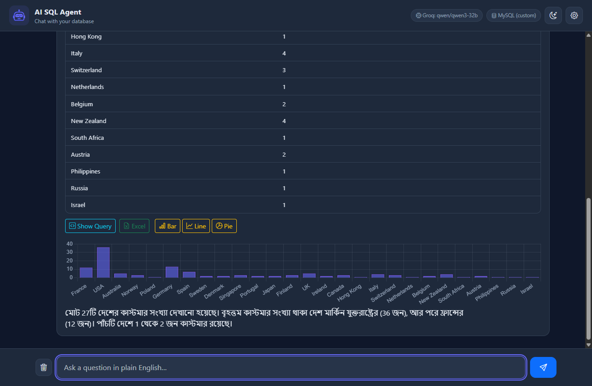

# AI SQL Agent — Chat with your Database

A local, privacy-friendly AI assistant that turns natural-language questions
into **safe, read-only SQL**, runs them against a relational database, and
streams back a plain-language answer — with the generated SQL, an HTML result
table, an Excel export and an optional chart.

Built with **.NET 10 + ASP.NET Core MVC**, **Microsoft Semantic Kernel**
(the .NET equivalent of LangChain), a **local LLM via Ollama** (`qwen2.5-coder`,
runs offline with no API keys) and an **optional Groq cloud** provider for speed.



*"How many customers per country" → the agent writes the SQL, returns the full
result as a table, offers Bar/Line/Pie charts and an Excel export, and answers in
your language (here, Bangla) — running on MySQL via the Groq cloud model.*

---

## What it does

```
Question (plain English/Bangla)
        ↓
ASP.NET Core MVC  ──►  Semantic Kernel  ──►  Ollama (Qwen 2.5 Coder)
        ↓                                         (generates SQL)
SQL Safety Layer  (read-only, single SELECT, row limit)
        ↓
PostgreSQL / MySQL / SQL Server   (READ ONLY transaction)
        ↓
HTML table + Show-Query modal + Excel + Chart + streamed explanation
```

Ask things like:
- *"Which students were absent this month?"*
- *"Top 5 teachers by salary."*
- *"How many fees are still unpaid for July?"*

See **[EXAMPLES.md](EXAMPLES.md)** for a big copy‑paste set — English / Bangla /
Banglish questions and direct SQL (correct, partially‑wrong, and rejected) for
both the demo PostgreSQL DB and the MySQL classicmodels sample. For behaviour by
intent (greeting vs meta/help vs data vs dangerous vs follow-up), see
**[TEST-PROMPTS.md](TEST-PROMPTS.md)**.

To sanity-check a running instance automatically, run the end-to-end smoke test —
it drives the real endpoint across every intent branch and (when the demo
Postgres container is up) the schema self-heal and reserved-word quoting:

```bash
# app must be running; provider 1 = Groq (reliable), 0 = Ollama (local)
PROVIDER=1 scripts/e2e-smoke.sh
```

It runs the ~20 checks **sequentially** and retries once on a transient rate
limit, so on Groq's free tier (≈6000 tokens/min) it takes a few minutes but is
reliable — the tokens-per-minute cap, not the script, is the ceiling, so running
the checks in parallel only trips HTTP 429. If you have real TPM headroom (a paid
Groq tier or a strong local Ollama) you can parallelise with `CONCURRENCY=4`.
On Windows, double-click **`scripts/run-e2e.bat`** to build, start, test, and stop
in one go.

---

## Key features

| Area | Detail |
|------|--------|
| **AI orchestration** | Microsoft Semantic Kernel over Ollama's `IChatClient` |
| **Local LLM** | `qwen2.5-coder` — runtime-switchable model dropdown (3B / 14B) |
| **Model loader** | Warm-up call + `load_duration` tracking → live "Loading model…" state |
| **SQL safety** | Defense in depth (see below) |
| **Multi-dialect** | PostgreSQL, MySQL, SQL Server via an `ISqlDialect` abstraction |
| **Runtime data source** | Paste any connection string in the UI, or use the seeded demo DB |
| **Streaming** | Answer streamed token-by-token over Server-Sent Events (SSE) |
| **Results UI** | Responsive chat, HTML table, **Show Query** modal, **Excel** export (ClosedXML), **Chart.js** graphs |

---

## SQL safety (defense in depth)

The LLM is **never trusted**. A generated query must pass every layer:

1. **Cleaned** — markdown fences / `<think>` blocks / labels stripped from the model output.
2. **Single statement** — text after the first `;` is dropped, so `;`-chained payloads can't run.
3. **SELECT-only** — must start with `SELECT` (or a `WITH … SELECT` CTE).
4. **Keyword blocklist** — `INSERT/UPDATE/DELETE/DROP/ALTER/TRUNCATE/CREATE/GRANT/EXEC/…` rejected.
5. **READ ONLY transaction** — executed inside a transaction that is always rolled back (never committed).
6. **Read-only DB user** — the demo DB connects as a `SELECT`-only role.
7. **Statement timeout** — heavy queries are killed.
8. **Audit log** — every generated SQL is logged (Serilog).

### Read-only enforcement by dialect

The database-level guard differs because the engines differ:

| Dialect | DB-level read-only guard |
|---------|--------------------------|
| **PostgreSQL** | `SET SESSION … TRANSACTION READ ONLY` — the DB itself rejects writes. |
| **MySQL** | `SET SESSION TRANSACTION READ ONLY` — the DB itself rejects writes. |
| **SQL Server** | No such statement exists in T-SQL. It uses `ApplicationIntent=ReadOnly` (routes to a read replica where one exists) plus the SELECT-only validator, the rolled-back transaction, and — recommended — a **read-only login**. |

So on SQL Server the strongest backstop is a least-privileged (read-only) login;
the app-level validator is the primary guard. On PostgreSQL/MySQL the DB enforces
read-only directly as well.

---

## Architecture (Clean Architecture, no MediatR)

```
src/
  SqlAgent.Domain          contracts + models (no dependencies)
  SqlAgent.Application      PromptBuilder, SqlSafetyValidator, QueryAgentService
  SqlAgent.Infrastructure   Ollama (Semantic Kernel), DB access, dialects
  SqlAgent.Web              ASP.NET Core MVC (controller, views, SSE, Excel)
docker-compose.yml          PostgreSQL (seeded) — Ollama runs natively
```

> MediatR/CQRS was intentionally omitted: this is a single, clear pipeline,
> and MediatR's request/response model is awkward for streaming. The layers
> keep the app testable and let the AI provider / DB dialect be swapped freely.

---

## Quick start (reviewers) ⚡

Only **Docker Desktop** is needed — no .NET SDK, no Visual Studio (the app is
built inside a container).

```bash
git clone https://github.com/rayhanul17/ai-sql-agent.git
cd ai-sql-agent

# Run everything (PostgreSQL + Ollama + 3B model + app):
docker compose -f docker-compose.full.yml up --build

# → open http://localhost:8080
```

That's the whole thing on the local **Ollama 3B** model. The two options below
are optional:

**Also want the larger 7B model?** (~4.5 GB extra — needs more disk/RAM):

```bash
docker compose -f docker-compose.full.yml --profile full up --build
```

**Also want to try the Groq cloud provider?** Get a free key at
<https://console.groq.com/keys> (no card needed), then:

```bash
cp .env.example .env         # then edit .env: GROQ_API_KEY=gsk_your_key
docker compose -f docker-compose.full.yml up --build
```

`.env` is gitignored, so your key stays local. Without it, the Groq models
simply appear disabled and everything runs on Ollama. In the app, pick the
provider and model from the settings panel (gear / menu icon).

---

## Getting started

There are two ways to run it. **Path B needs only Docker** — no .NET SDK,
no Visual Studio (the app is built inside a container). Path A is for
development, where you run the app yourself and iterate quickly.

### Path B — All-in-one Docker (recommended for reviewers) 🐳

Everything runs in containers: PostgreSQL, Ollama (+ model), and the app.

**Requires only [Docker Desktop](https://www.docker.com/).** No .NET SDK — the
Dockerfile is multi-stage and builds the app with the .NET 10 SDK *inside*
the build container, then ships a slim runtime image.

```bash
# 1. (Optional) enable the Groq cloud provider:
cp .env.example .env          # then put your key in .env: GROQ_API_KEY=gsk_...
#    Skip this to run with local Ollama only.

# 2. Build + start the whole stack (pulls the 3B model, ~2 GB):
docker compose -f docker-compose.full.yml up --build

# 3. Open http://localhost:8080
```

First run downloads the .NET SDK image and the 3B model, so give it a few
minutes. **The default stack pulls only the 3B model** — safe for machines
with limited disk/RAM/network. To also pull the larger 7B model (~4.5 GB):

```bash
docker compose -f docker-compose.full.yml --profile full up --build
```

### Path A — Development (app runs natively)

Infra in Docker, app run by you — fastest to iterate on the code.

**Requires [Docker Desktop](https://www.docker.com/) + [.NET 10 SDK](https://dotnet.microsoft.com/)**
(you run the app with `dotnet run`).

```bash
# Start PostgreSQL (seeded) + Ollama, pulling the default 3B model (~2 GB):
docker compose up -d

# Optional — also pull the 7B model (~4.5 GB); skip on slow net / low disk:
docker compose --profile full up -d

# For Groq, put your key in appsettings.Development.json (gitignored):
#   { "Groq": { "ApiKey": "gsk_..." } }   (see the .template file)

# Run the web app:
dotnet run --project src/SqlAgent.Web
```

`docker compose up` creates `agentdb`, seeds the demo schema (students,
teachers, attendance, fees, leaves) and a read-only role `agent_readonly`.
Only pulled models are enabled in the UI dropdown; the 7B option shows as
"not pulled" until you run the `--profile full` command (or
`docker exec agent-ollama ollama pull qwen2.5-coder:7b`).

> In development, PostgreSQL is published on host port **5433** (to avoid a
> local 5432 already in use); the app's default connection string points at
> 5433. In the all-in-one stack the app reaches Postgres by service name.

---

## Using your own database

In the sidebar, pick **PostgreSQL / MySQL / SQL Server (custom)** and paste a
connection string. The agent introspects that database's live schema and
answers against it. Prefer a **read-only** connection string — the app enforces
read-only, but a least-privileged user is the safest backstop.

The introspected schema is **cached** (per connection + dialect) so it's read
once on Save instead of on every query. To keep it from going stale when the DB
changes, the cache (a) expires after `Agent:SchemaCacheTtlMinutes` (default 30),
(b) is **force-refreshed automatically when a query fails** — so a renamed or
dropped column is re-read and the query self-corrects on retry — and (c) can be
refreshed manually with the **Refresh schema** button.

### Which host to use

The `Server=` / `Host=` value depends on **where the app runs**, not where the
DB runs:

| App is running… | Use this host for a DB on your machine |
|-----------------|----------------------------------------|
| Natively (`dotnet run`) | `localhost` |
| In a container (all-in-one Docker) | `host.docker.internal` |
| In the same compose network as the DB | the DB's service name (e.g. `postgres`) |

If the containerised app can't reach a DB via `localhost`, that's expected —
`localhost` inside a container means the container itself. You'll see
*"Unable to connect to any of the specified MySQL hosts"* or similar. Switch to
`host.docker.internal` (the DB is published on a host port), or attach the DB
container to the app's network:

```bash
docker network ls                                   # find e.g. ai-sql-agent_default
docker network connect ai-sql-agent_default mysql   # then use Server=mysql
```

### MySQL 8 note

MySQL 8 defaults to the `caching_sha2_password` auth plugin. Over a non-SSL
connection the client needs the server's RSA key, so add
`AllowPublicKeyRetrieval=True` (the MySQL template already includes it):

```
Server=host.docker.internal;Port=3306;Database=your_db;User ID=root;Password=…;SslMode=None;AllowPublicKeyRetrieval=True
```

Without it you'll see *"Authentication method 'caching_sha2_password' failed …"*.

---

## Logs

The app logs to the console **and** a daily rolling file
`agent-yyyyMMdd.log`. It records startup config, model/data-source changes
(on Save), the generated SQL, and errors. Connection-string passwords are masked.

**Running natively** — the file is in the project folder:

```bash
# path: src/SqlAgent.Web/Logs/agent-<date>.log
type   src\SqlAgent.Web\Logs\agent-*.log      # Windows
cat    src/SqlAgent.Web/Logs/agent-*.log       # macOS/Linux
```

**Running in Docker** — the full stack mounts the container's logs to
`./docker-logs` on your host, so just read them there:

```bash
cat ./docker-logs/agent-*.log
```

Or read them straight from the container:

```bash
docker logs -f agent-app                       # console stream (simplest)
docker exec agent-app cat /app/Logs/agent-*.log  # the log file inside the container
docker cp agent-app:/app/Logs ./container-logs   # copy the folder to the host
```

---

## Managing the stack

The containers are set to `restart: unless-stopped`, and the app has a
healthcheck — so if it crashes or hangs, **Docker restarts it automatically**.
You rarely need to intervene, but the common commands are:

```bash
COMPOSE="docker compose -f docker-compose.full.yml"

$COMPOSE ps                 # container status (healthy/unhealthy)
$COMPOSE restart app        # restart just the app (keeps data)
$COMPOSE restart            # restart everything
$COMPOSE down               # stop all (data kept in volumes)
$COMPOSE up --build         # rebuild + start (after pulling new code)
$COMPOSE down -v            # stop AND wipe data (re-seeds DB, re-pulls model)
```

If a page ever loads blank, check `$COMPOSE ps` — the app may be restarting or
still waiting on Ollama's first model pull. `docker logs --tail 40 agent-app`
shows why.

---

## LLM providers (Ollama + optional Groq)

The app talks to LLMs through an `IAiProvider` abstraction, resolved per
request. Two providers ship:

| Provider | Where | Models | Notes |
|----------|-------|--------|-------|
| **Ollama** (default) | Local | `qwen2.5-coder:3b`, `:7b` | Free, offline, private |
| **Groq** (optional) | Cloud | `qwen/qwen3-32b`, `llama-3.3-70b-versatile` | Very fast; needs a free API key |

Pick the provider (and its model) from the settings panel. Ollama stays the
primary/default; Groq is a fast cloud fallback — handy on machines where a
local model is too slow.

> Model capability scales with size. Everyday questions (counts, top-N,
> filters, per-group aggregates) work on all four models. A few harder
> meta-questions — e.g. "how many rows in each table", which needs a
> multi-table `UNION ALL COUNT(*)` — are handled by 7B and the cloud models,
> but the small 3B may decline them. Reasoning models (Qwen3) that emit a
> `<think>` block are handled: it's stripped from both the SQL and the answer.

### Enabling Groq

Get a free API key at <https://console.groq.com/keys> (no card required), then
provide it depending on how you run the app — both locations are gitignored:

- **All-in-one Docker (Path B):** put it in `.env` at the repo root:
  ```
  GROQ_API_KEY=gsk_your_key_here
  ```
  (`.env.example` shows the shape.) Compose passes it to the app as `Groq__ApiKey`.
- **Development (Path A):** put it in `src/SqlAgent.Web/appsettings.Development.json`:
  ```json
  { "Groq": { "ApiKey": "gsk_your_key_here" } }
  ```
  (a `.template` file shows the shape.)

Never commit the real key. Restart the app — Groq models then become
selectable in the settings panel. Leave it empty to run with Ollama only.

## Model strategy

One family (**Qwen 2.5 Coder**) keeps prompting consistent while scaling by size:

| Tier | Model | Approx RAM | For |
|------|-------|-----------|-----|
| Minimum | `qwen2.5-coder:3b` | ~3 GB | modest machines (default) |
| Better | `qwen2.5-coder:7b` | ~6 GB | better SQL, 16 GB RAM |

Switching models in the UI triggers a warm-up; the first request after a
cold switch loads the model into RAM (a few seconds for larger models), then
subsequent queries are fast. A larger tier (e.g. 14B) or a cloud LLM can be
added later by one config line.

---

## Known limitations

Most of these scale away with a larger model (7B, or the Groq cloud models):

- **Small-model language quality.** English works well on all models. Bangla
  and Banglish questions are understood and answered by 7B and the cloud
  models; the small **3B** understands them and returns the right data, but its
  Bangla wording can be rough. For polished Bangla, use 7B or a Groq model.
- **Hard meta-questions.** Everyday queries (counts, top-N, filters, per-group
  aggregates) work everywhere. A multi-table question like "how many rows in
  each table" (needs a `UNION ALL COUNT(*)`) is reliable on 7B / cloud; 3B
  sometimes declines it.
- **Very wide databases.** The whole schema is sent to the model per query, so
  a database with ~100+ tables produces a very large prompt. That can exceed a
  cloud model's per-minute token limit (Groq free tier) or be slow on a local
  CPU model. This app targets small-to-medium schemas (the seeded demo, or a
  focused DB); relevant-table selection for huge schemas is future work.
- **Dialect coverage.** PostgreSQL and MySQL are exercised end-to-end (the demo
  Postgres DB and a real MySQL, incl. a 140-table read). **SQL Server** shares
  the same abstraction and its introspection/read-only paths are implemented,
  but it hasn't been run against a live SQL Server instance yet — treat it as
  supported-but-unverified, and use a read-only login (see the safety section).
- **Local speed.** On a CPU-only machine, Ollama replies token-by-token but
  slowly, and switching to a larger local model has a cold-load delay. Groq
  (cloud) is near-instant — handy for demos on modest hardware.
- **Syntax validation is the database's job.** The safety layer enforces
  read-only/single-SELECT but not SQL correctness; a slightly malformed query
  is caught by the database and then auto-retried once with the error fed back
  to the model.
- **Prompt kept lightweight on purpose.** Over-constraining the prompt made the
  3B model refuse valid questions, so the instructions are deliberately concise
  and lean on the database + retry as the safety net.

## Future improvements
- Add a larger tier (14B) and optional cloud LLM (OpenAI/Claude) via the same `IAiProvider`.
- Query-result caching (Redis) for repeated questions.
- Role-based data access (row-level restrictions per user).
- Few-shot examples in the prompt to improve SQL accuracy.
- NoSQL support (e.g. MongoDB) via a parallel `IDataSourceAgent` — kept out of
  v1 to stay focused on Text-to-SQL.

---

## Tech stack
.NET 10 · ASP.NET Core MVC · Semantic Kernel · Ollama (Qwen 2.5 Coder) ·
PostgreSQL / MySQL / SQL Server · Npgsql · MySqlConnector · Microsoft.Data.SqlClient ·
ClosedXML · Chart.js · Bootstrap 5 · Serilog · Docker Compose
